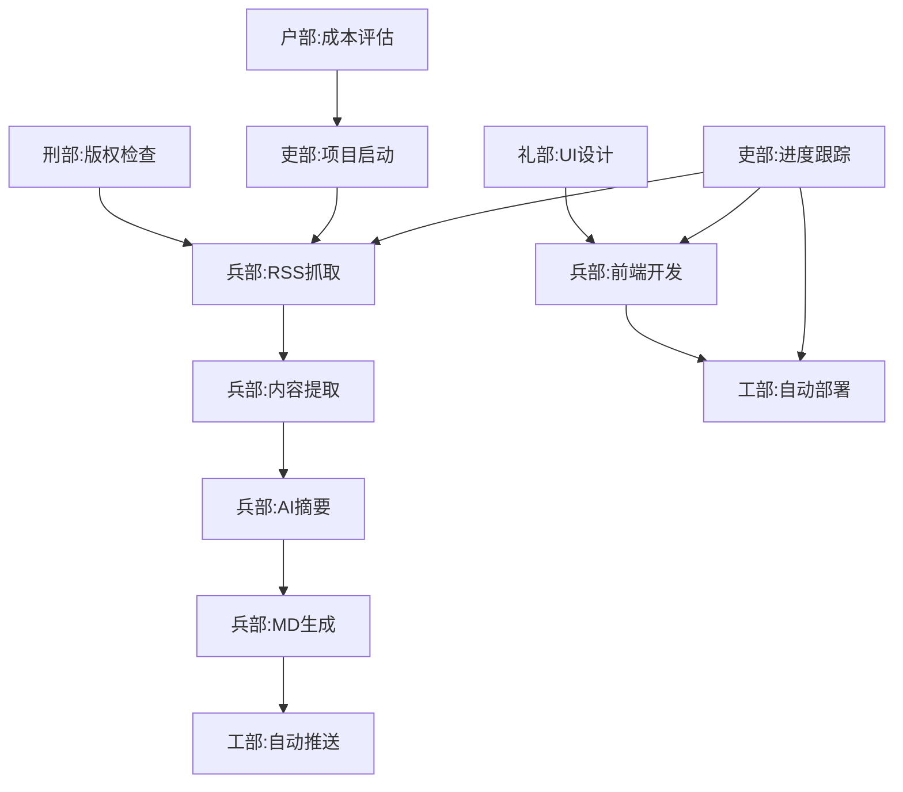

# 歪朝会议第一次 - 任务分工清单

**项目代号：** HN每日新闻推送系统  
**协调者：** 司礼监  
**执行者：** 六部（兵部、户部、工部、吏部、礼部、刑部）  
**创建时间：** 2026-03-11  

---

## 一、项目概况

### 1.1 核心目标
为程序员提供每日精选的Hacker News热门博客内容，通过AI生成中文简报，自动推送到GitHub Pages。

### 1.2 技术栈
- **后端：** Python 3.9+ (RSS抓取 + AI摘要)
- **前端：** React 18+ (Markdown渲染)
- **部署：** GitHub Actions + GitHub Pages

### 1.3 时间节点
- **Phase 1（后端）：** 3天
- **Phase 2（前端）：** 2天
- **Phase 3（测试部署）：** 2天
- **总工期：** 7天

---

## 二、六部分工

### 🗡️ 兵部（软件工程、系统架构）

**核心职责：** 核心代码开发 + 系统架构

**Phase 1 任务（后端开发）：**
1. **RSS抓取模块**
   - [ ] 解析OPML文件获取RSS源列表
   - [ ] 并发抓取60+个RSS feed（限流控制）
   - [ ] 解析RSS/Atom格式（兼容多种格式）
   - [ ] 去重逻辑（基于文章链接）
   - [ ] 过滤48小时内新文章
   - **输出：** `backend/modules/rss_fetcher.py`

2. **内容提取模块**
   - [ ] 访问文章原始链接
   - [ ] 提取正文内容（去除广告/导航）
   - [ ] 提取关键段落（前5段）
   - [ ] 限制内容长度（1500字符）
   - [ ] 错误处理（超时/404）
   - **输出：** `backend/modules/content_extractor.py`

3. **AI摘要模块**
   - [ ] 集成OpenAI/Claude API
   - [ ] 设计Prompt（生成100-200字中文摘要）
   - [ ] 翻译标题为中文
   - [ ] 降级策略（API失败时使用原文摘要）
   - [ ] 限流控制（避免API超限）
   - **输出：** `backend/modules/ai_summarizer.py`

4. **Markdown生成模块**
   - [ ] 按日期生成MD文件（YYYY-MM-DD.md）
   - [ ] 按来源分类文章
   - [ ] 格式化输出（标题/摘要/链接/来源）
   - [ ] 添加统计数据（文章总数）
   - **输出：** `backend/modules/markdown_generator.py`

5. **主程序**
   - [ ] 整合所有模块
   - [ ] 添加命令行参数（--dry-run / --date）
   - [ ] 错误处理和日志记录
   - **输出：** `backend/main.py`

**Phase 2 任务（前端开发）：**
1. **React项目初始化**
   - [ ] 基于模板 782042369/react-template
   - [ ] 安装依赖（react-markdown, remark-gfm, rehype-highlight）
   - [ ] 配置路由（react-router-dom）
   - **输出：** `frontend/` 目录结构

2. **首页组件**
   - [ ] 文章列表展示（卡片式布局）
   - [ ] 日期选择器（查看历史）
   - [ ] 来源筛选（下拉菜单）
   - [ ] 搜索框（标题/摘要搜索）
   - [ ] 分页组件（每页20篇）
   - **输出：** `frontend/src/pages/Home.jsx`

3. **Markdown渲染器**
   - [ ] 渲染MD文件为HTML
   - [ ] 代码高亮（highlight.js）
   - [ ] 表格样式
   - [ ] 响应式布局
   - **输出：** `frontend/src/components/MarkdownRenderer.jsx`

4. **历史记录页**
   - [ ] 日历视图选择日期
   - [ ] 按月份归档
   - [ ] 快速跳转到指定日期
   - **输出：** `frontend/src/pages/History.jsx`

**技术要求：**
- 代码规范：遵循PEP8（Python）和Airbnb Style（JavaScript）
- 注释：关键函数必须添加文档字符串
- 单元测试：核心模块覆盖率 > 80%
- 性能：单次抓取完成时间 < 5分钟

---

### 🏗️ 工部（DevOps、服务器运维）

**核心职责：** 部署 + 监控 + 自动化

**Phase 1 任务（部署配置）：**
1. **GitHub Actions配置**
   - [ ] 创建 `.github/workflows/deploy.yml`
   - [ ] 配置Python环境（3.9+）
   - [ ] 配置Node.js环境（18+）
   - [ ] 设置定时触发（每天UTC 0:00 = 北京时间8:00）
   - [ ] 配置secrets（OPENAI_API_KEY）
   - **输出：** `.github/workflows/deploy.yml`

2. **GitHub Actions - 每日抓取任务**
   - [ ] 拉取最新代码
   - [ ] 安装Python依赖
   - [ ] 执行 `python backend/main.py`
   - [ ] 提交生成的MD文件到data/目录
   - [ ] 推送到main分支
   - **输出：** `.github/workflows/fetch.yml`

3. **GitHub Actions - 自动部署**
   - [ ] 监听data/目录变更
   - [ ] 构建前端项目
   - [ ] 部署到GitHub Pages
   - **输出：** 集成到 `deploy.yml`

4. **环境配置**
   - [ ] 创建 `backend/requirements.txt`
   - [ ] 创建 `frontend/package.json`
   - [ ] 创建 `backend/config.py`（配置文件）
   - [ ] 创建 `.env.example`（环境变量模板）
   - **输出：** 配置文件

**Phase 2 任务（监控告警）：**
1. **日志系统**
   - [ ] 配置Python logging模块
   - [ ] 输出到 `/var/log/hn-news/`
   - [ ] 日志轮转（保留7天）
   - **输出：** `backend/utils/logger.py`

2. **错误告警**
   - [ ] 抓取失败时发送飞书消息
   - [ ] 连续3天无新文章时告警
   - [ ] GitHub推送失败时发送邮件
   - **输出：** `backend/utils/alert.py`

3. **健康检查**
   - [ ] 创建健康检查端点（可选）
   - [ ] 监控每日文章数量
   - [ ] 监控AI API调用次数
   - **输出：** `backend/utils/healthcheck.py`

**技术要求：**
- GitHub Actions执行成功率 > 95%
- 日志保留7天
- 告警延迟 < 5分钟

---

### 📋 吏部（项目管理、创业孵化）

**核心职责：** 进度跟踪 + 协调 + 文档

**Phase 1 任务（项目管理）：**
1. **任务跟踪**
   - [ ] 创建GitHub Projects看板
   - [ ] 将所有任务录入看板（To Do / In Progress / Done）
   - [ ] 为每个任务分配负责人和截止日期
   - [ ] 每日更新进度
   - **输出：** GitHub Projects看板

2. **进度汇报**
   - [ ] 每日在群里汇报进度（上午10:00）
   - [ ] 标记延期任务和风险
   - [ ] 协调跨部门依赖
   - **输出：** 每日进度报告

3. **文档维护**
   - [ ] 更新 `README.md`（项目介绍、使用说明）
   - [ ] 维护 `docs/API.md`（API文档）
   - [ ] 维护 `docs/DEPLOYMENT.md`（部署文档）
   - [ ] 维护 `CHANGELOG.md`（变更日志）
   - **输出：** 完整文档体系

4. **需求变更管理**
   - [ ] 收集需求变更请求
   - [ ] 评估变更影响
   - [ ] 更新需求文档
   - [ ] 通知相关部门
   - **输出：** 需求变更记录

**Phase 2 任务（用户增长）：**
1. **用户反馈收集**
   - [ ] 创建反馈渠道（GitHub Issues）
   - [ ] 收集用户建议
   - [ ] 整理需求优先级
   - **输出：** 需求池

2. **数据分析**
   - [ ] 统计每日访问量（Google Analytics）
   - [ ] 统计文章阅读量
   - [ ] 分析用户行为
   - **输出：** 数据分析报告

**技术要求：**
- 任务完成率 > 90%
- 文档更新及时（变更后24小时内）
- 进度汇报准确

---

### 🎨 礼部（品牌营销、内容创作）

**核心职责：** UI/UX设计 + 文案 + 品牌形象

**Phase 1 任务（前端UI/UX）：**
1. **设计系统**
   - [ ] 定义配色方案（主色/辅色/强调色）
   - [ ] 定义字体系统（标题/正文/代码）
   - [ ] 定义间距系统（4px基准）
   - [ ] 创建设计规范文档
   - **输出：** `frontend/src/styles/design-system.css`

2. **首页设计**
   - [ ] 头部设计（Logo + 标题 + 日期）
   - [ ] 筛选栏设计（来源下拉 + 搜索框）
   - [ ] 文章卡片设计（标题/摘要/来源/链接）
   - [ ] 响应式布局（移动端适配）
   - **输出：** `frontend/src/pages/Home.module.css`

3. **文章详情页设计**
   - [ ] Markdown内容样式
   - [ ] 代码块样式（暗色主题）
   - [ ] 表格样式
   - [ ] 原文链接按钮样式
   - **输出：** `frontend/src/pages/Article.module.css`

4. **历史记录页设计**
   - [ ] 日历组件样式
   - [ ] 月份归档样式
   - [ ] 日期选择交互
   - **输出：** `frontend/src/pages/History.module.css`

**Phase 2 任务（文案与品牌）：**
1. **文案撰写**
   - [ ] 项目Slogan（"每日精选，技术前沿"）
   - [ ] 网站标题和描述（SEO优化）
   - [ ] README.md的开篇介绍
   - [ ] GitHub仓库描述
   - **输出：** 品牌文案

2. **视觉素材**
   - [ ] 设计Logo（SVG格式）
   - [ ] 设计Favicon
   - [ ] 设计社交分享图（Open Graph）
   - **输出：** `frontend/public/logo.svg`, `frontend/public/favicon.ico`

3. **SEO优化**
   - [ ] 添加meta标签（title, description, keywords）
   - [ ] 添加Open Graph标签
   - [ ] 添加Structured Data（JSON-LD）
   - [ ] 创建 `sitemap.xml`
   - [ ] 创建 `robots.txt`
   - **输出：** SEO优化文件

**技术要求：**
- 移动端友好（响应式设计）
- 页面加载速度 < 2秒
- SEO得分 > 90（Lighthouse）

---

### ⚖️ 刑部（法务合规、知识产权）

**核心职责：** 版权检查 + 合规 + 数据隐私

**Phase 1 任务（合规检查）：**
1. **RSS源版权检查**
   - [ ] 检查60+个RSS源的使用条款
   - [ ] 确认是否允许抓取和摘要
   - [ ] 记录需要授权的源
   - [ ] 生成合规源列表
   - **输出：** `docs/COPYRIGHT.md`

2. **开源协议选择**
   - [ ] 评估MIT/Apache 2.0/GPL协议
   - [ ] 选择合适的开源协议
   - [ ] 创建 `LICENSE` 文件
   - [ ] 在README中添加协议说明
   - **输出：** `LICENSE`

3. **数据隐私保护**
   - [ ] 检查是否收集用户数据
   - [ ] 创建隐私政策（如果需要）
   - [ ] 添加Cookie提示（如果使用Analytics）
   - **输出：** `docs/PRIVACY.md`（可选）

**Phase 2 任务（API合规）：**
1. **AI API使用合规**
   - [ ] 检查OpenAI/Claude API使用条款
   - [ ] 确认内容生成版权归属
   - [ ] 记录API使用限制
   - **输出：** `docs/API_COMPLIANCE.md`

2. **第三方库合规**
   - [ ] 检查所有依赖库的许可证
   - [ ] 记录兼容性问题
   - [ ] 创建第三方库清单
   - **输出：** `docs/DEPENDENCIES.md`

**技术要求：**
- 所有RSS源使用合规
- 开源协议清晰
- 无知识产权纠纷风险

---

### 💰 户部（财务预算、电商运营）

**核心职责：** 成本控制 + 用户增长策略

**Phase 1 任务（成本预算）：**
1. **AI API成本评估**
   - [ ] 计算每日文章数量（约15篇）
   - [ ] 计算每日token消耗（约15,000 tokens）
   - [ ] 评估OpenAI GPT-4成本（$0.45/天）
   - [ ] 评估Claude API成本（$0.225/天）
   - [ ] 评估本地模型成本（免费）
   - **输出：** `docs/COST_ANALYSIS.md`

2. **服务器成本评估**
   - [ ] GitHub Pages（免费）
   - [ ] GitHub Actions（免费额度2000分钟/月）
   - [ ] 域名成本（可选）
   - [ ] 总成本评估
   - **输出：** 月度成本预算

3. **成本优化方案**
   - [ ] 评估免费替代方案（本地模型）
   - [ ] 评估API限流策略
   - [ ] 评估缓存策略（减少重复调用）
   - **输出：** 成本优化建议

**Phase 2 任务（用户增长）：**
1. **推广策略**
   - [ ] 在技术社区分享（V2EX、掘金、SegmentFault）
   - [ ] 在社交媒体推广（Twitter、微博）
   - [ ] 在GitHub Trending争取曝光
   - **输出：** 推广计划

2. **用户留存策略**
   - [ ] 添加RSS订阅功能（可选）
   - [ ] 添加邮件订阅功能（可选）
   - [ ] 添加收藏功能（可选）
   - **输出：** 留存优化方案

**技术要求：**
- 月度成本 < $20
- 用户增长计划可行
- ROI分析清晰

---

## 三、任务依赖关系

**关键路径：**
刑部版权检查 → 兵部后端开发 → 工部部署 → 兵部前端开发 → 工部自动部署

**并行任务：**
- 礼部UI设计 || 兵部后端开发
- 户部成本评估 || 刑部版权检查
- 吏部文档维护 || 所有开发任务

---

## 四、时间节点（7天计划）

### Day 1（2026-03-12）
- **刑部：** 完成RSS源版权检查
- **户部：** 完成成本预算
- **吏部：** 创建GitHub Projects看板
- **礼部：** 完成设计系统

### Day 2（2026-03-13）
- **兵部：** 完成RSS抓取模块 + 内容提取模块
- **工部：** 完成GitHub Actions配置
- **吏部：** 完成基础文档

### Day 3（2026-03-14）
- **兵部：** 完成AI摘要模块 + Markdown生成模块 + 主程序
- **工部：** 完成日志系统和错误告警
- **刑部：** 完成开源协议选择

### Day 4（2026-03-15）
- **兵部：** 完成前端项目初始化 + 首页组件
- **礼部：** 完成所有UI设计
- **吏部：** 完成API文档

### Day 5（2026-03-16）
- **兵部：** 完成Markdown渲染器 + 历史记录页
- **工部：** 完成自动部署配置
- **户部：** 完成推广策略

### Day 6（2026-03-17）
- **全部门：** 功能测试
- **工部：** 性能优化
- **吏部：** 完成部署文档

### Day 7（2026-03-18）
- **工部：** 正式部署上线
- **吏部：** 完成用户文档
- **全部门：** 项目复盘

---

## 五、协作流程

### 5.1 每日站会（北京时间 10:00）
**主持人：** 司礼监  
**参与者：** 六部负责人  
**内容：**
1. 昨天完成了什么？
2. 今天计划做什么？
3. 遇到什么阻碍？

### 5.2 任务流转
1. 吏部创建任务（GitHub Issues）
2. 分配给相关部门
3. 部门负责人领取任务
4. 开发完成后提交PR
5. 兵部Review代码
6. 工部测试部署
7. 吏部关闭任务

### 5.3 文档协作
- **共享文档：** GitHub Wiki
- **实时协作：** 飞书文档（可选）
- **版本控制：** Git

### 5.4 沟通渠道
- **日常沟通：** 飞书群聊
- **任务讨论：** GitHub Issues
- **紧急事项：** @司礼监

---

## 六、风险管理

| 风险 | 影响 | 应对措施 | 负责部门 |
|------|------|----------|----------|
| RSS源失效 | 数据缺失 | 刑部定期检查 | 刑部 |
| AI API超限 | 摘要失败 | 户部成本监控 | 户部 |
| 部署失败 | 用户无法访问 | 工部备用方案 | 工部 |
| 延期交付 | 项目延期 | 吏部进度预警 | 吏部 |
| UI体验差 | 用户流失 | 礼部用户测试 | 礼部 |
| 代码Bug | 功能异常 | 兵部Code Review | 兵部 |

---

## 七、成功标准

### 7.1 技术指标
- [ ] 每日抓取成功率 > 95%
- [ ] AI摘要生成成功率 > 90%
- [ ] 页面加载速度 < 2秒
- [ ] GitHub Actions执行成功率 100%

### 7.2 用户指标
- [ ] Day 7上线时有至少1篇文章
- [ ] 第1个月DAU > 100
- [ ] 用户留存率 > 40%

### 7.3 项目指标
- [ ] 所有任务按时完成
- [ ] 无重大Bug
- [ ] 文档完整清晰

---

## 八、下一步行动

### 立即行动（今天）
1. **吏部：** 创建GitHub Projects看板
2. **刑部：** 开始RSS源版权检查
3. **户部：** 开始成本评估
4. **礼部：** 开始设计系统定义
5. **工部：** 准备GitHub Actions模板
6. **兵部：** 准备开发环境

### 明天（Day 1）
- 按计划开始各模块开发

---

**文档版本：** v1.0  
**创建时间：** 2026-03-11 10:25  
**协调者：** 司礼监  
**状态：** 等待六部确认
